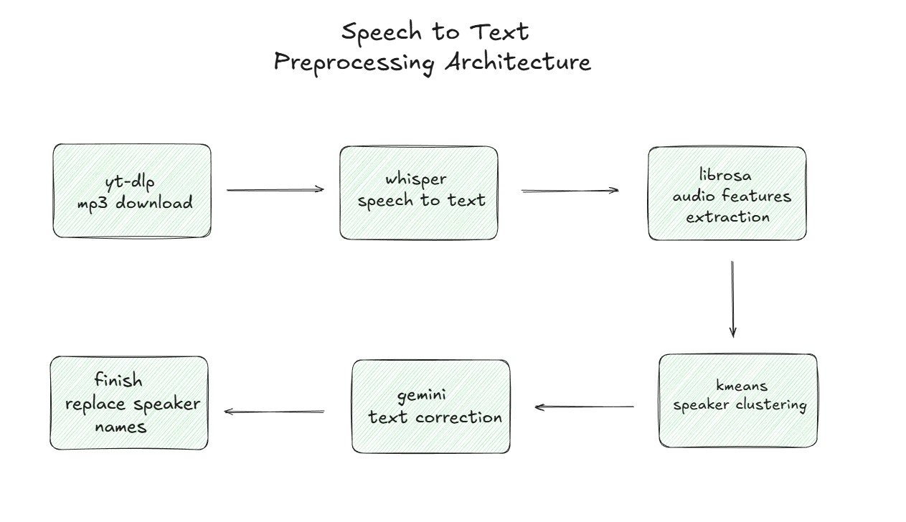

# DataCommit RAG Chatbot

A RAG (Retrieval-Augmented Generation) system for DataCommit podcast episodes. Downloads audio from YouTube, transcribes with Whisper, and enables Q&A using Haystack, ChromaDB, and Gemini.

> **DataCommit** is a Turkish podcast series where data science experts share their career journeys, technical knowledge, and industry experiences. [🎙️ Watch all episodes on YouTube](https://www.youtube.com/playlist?list=PLQvJkakaBRKcsi8mySTkgLvnrz0dSyIRF)


---


https://github.com/user-attachments/assets/a7aaf3b3-bb6a-45dc-b95c-28cc85f0faca

---

## Tech Stack

### Audio to Text Pipeline

- **Audio Download:** yt-dlp
- **Speech-to-Text:** Local Whisper-Turbo
- **Audio Processing:** FFmpeg, librosa, K-Means
- **Text Correction:** Gemini 2.5 Flash Agent

### RAG Pipeline

- **Backend:** Python, Flask
- **RAG Framework:** Haystack 2.x
- **Vector Database:** ChromaDB
- **LLM:** Google Gemini 3 Flash
- **Embeddings:** Sentence Transformers (all-MiniLM-L6-v2)
- **Frontend:** HTML, CSS, JavaScript

---

## Preprocessing Architecture



---

## Setup

### Prerequisites

- Python 3.10+
- Google Gemini API Key

### 1. Clone & Install

```bash
git clone https://github.com/enesmanan/DataCommit.git
cd DataCommit
python -m venv venv
venv\Scripts\activate  # Windows
pip install -r requirements.txt
```

### 2. Configure Environment

Create a `.env` file in the project root:

```env
GEMINI_API_KEY=your_gemini_api_key_here
```

### 3. Create Vector Database

```bash
python create_database.py
```

This creates `chroma_db/` folder containing:
- Episode chunks with metadata (guest name, episode number)
- Sentence Transformer embeddings

> To rebuild database: delete `chroma_db/` folder and run again.

### 4. Run Application

```bash
python app.py
```

Open browser at: **http://localhost:5000**

> For audio preprocessing (YouTube to transcript), see [/preprocessing](/preprocessing)

---

## Project Structure

```
DataCommit/
├── app.py                 # Flask web server
├── rag_pipeline.py        # RAG pipeline & Gemini integration
├── create_database.py     # Vector database creation
├── data/                  # Episode transcripts
├── chroma_db/             # Vector database (auto-generated)
├── static/                # Frontend assets (CSS, JS, images)
├── templates/             # HTML templates
└── preprocessing/         # Audio-to-text scripts
```

---

## 📬 Contact

**Enes Fehmi Manan**

- 🔗 LinkedIn: [linkedin.com/in/enesfehmimanan](https://www.linkedin.com/in/enesfehmimanan/)
- 🐙 GitHub: [github.com/enesmanan](https://github.com/enesmanan)
- 📧 Email: enesmanan768@gmail.com


<p align="center">
  Made with ❤️ for the Turkish Data Science Community
</p>
