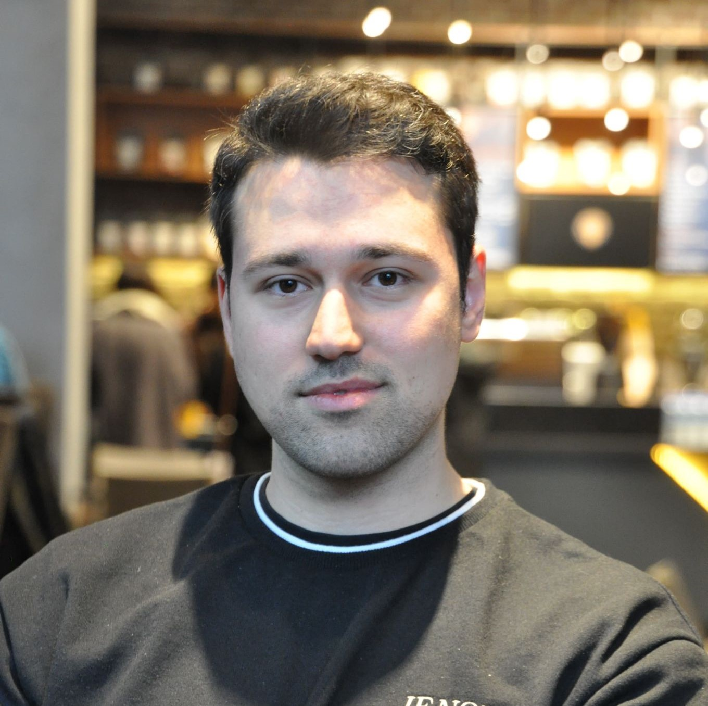
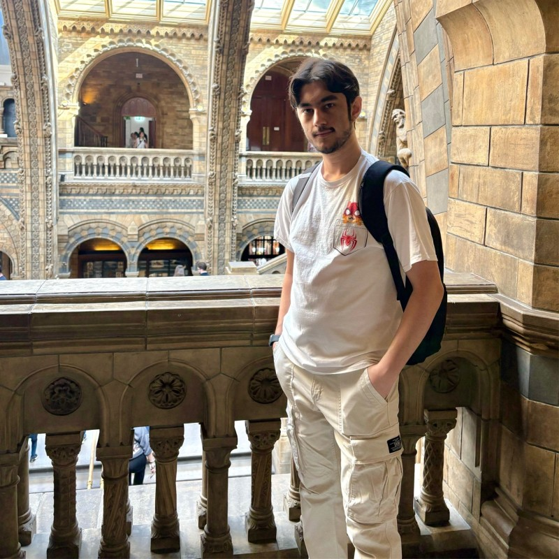
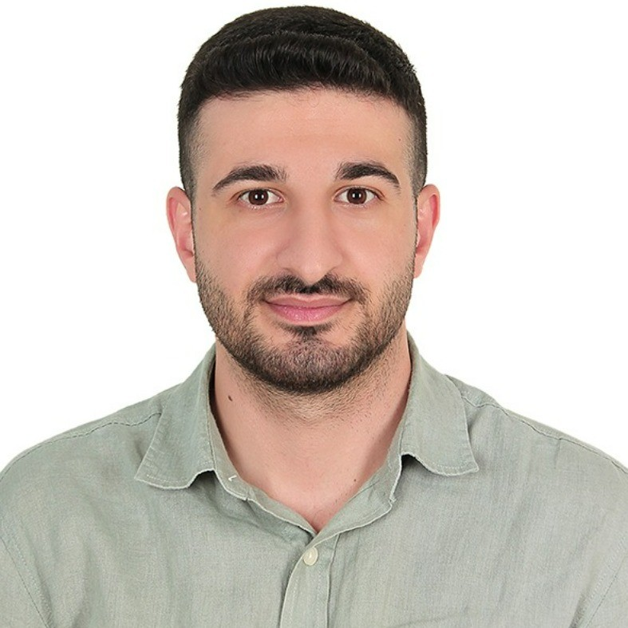

# 🎙️ DataCommit RAG Chatbot

A RAG (Retrieval-Augmented Generation) system for DataCommit podcast episodes. Downloads audio from YouTube, transcribes with Whisper, and enables Q&A using Haystack, ChromaDB, and Gemini.

> **DataCommit** is a Turkish podcast series where data science experts share their career journeys, technical knowledge, and industry experiences.


---

## Tech Stack

### Audio to Text Pipeline

- **Audio Download:** yt-dlp
- **Speech-to-Text:** Local Whisper-Turbo
- **Audio Processing:** FFmpeg, librosa, K-Means
- **Text Cleaning:** Gemini 2.5 Flash Agent

### RAG Pipeline

- **Backend:** Python, Flask
- **RAG Framework:** Haystack 2.x
- **Vector Database:** ChromaDB
- **LLM:** Google Gemini 3 Flash
- **Embeddings:** Sentence Transformers (all-MiniLM-L6-v2)
- **Frontend:** HTML, CSS, JavaScript

---

## Preprocessing Architecture


## Frontend Demo

<!-- Add your demo GIF here -->


---

## Episodes

<table>
<tr>
<td align="center" width="150">
<a href="https://linkedin.com/in/enesfehmimanan">
<br>
<b>Sunucu</b><br>
Enes Fehmi Manan
</a>
</td>
<td align="center" width="150">
<a href="https://www.youtube.com/watch?v=pu5tuQshGoU">
<br>
<b>Bölüm 1</b><br>
Kaan Bıçakçı
</a>
</td>
<td align="center" width="150">
<a href="https://www.youtube.com/watch?v=UCpZJwb8UAY">
<br>
<b>Bölüm 2</b><br>
Bilge Yücel
</a>
</td>
</tr>
<tr>
<td align="center" width="150">
<a href="https://www.youtube.com/watch?v=fGEApsNKKw0">
<br>
<b>Bölüm 3</b><br>
Alara Dirik
</a>
</td>
<td align="center" width="150">
<a href="https://www.youtube.com/watch?v=yhTxZr_bmDU">
<br>
<b>Bölüm 4</b><br>
Olgun Aydın
</a>
</td>
<td align="center" width="150">
<a href="https://www.youtube.com/watch?v=wusMEw9WOK4">
<br>
<b>Bölüm 5</b><br>
Eren Akbaba
</a>
</td>
</tr>
<tr>
<td align="center" width="150">
<a href="https://www.youtube.com/watch?v=63p7xIY_lgw">
<br>
<b>Bölüm 6</b><br>
Taner Şekmen
</a>
</td>
<td align="center" width="150">
<a href="https://www.youtube.com/watch?v=phQgJmz0KU4">
<br>
<b>Bölüm 7</b><br>
Murat Şahin
</a>
</td>
<td align="center" width="150">
<a href="https://www.youtube.com/watch?v=kTR9E1ahVcc">
<br>
<b>Bölüm 8</b><br>
Göker Güner
</a>
</td>
</tr>
</table>

---

##  Setup

### Prerequisites

- Python 3.10+
- Google Gemini API Key
- FFmpeg (for audio processing)

### 1. Clone the Repository

```bash
git clone https://github.com/enesmanan/DataCommit.git
cd DataCommit
```

### 2. Create Virtual Environment

```bash
python -m venv venv

# Windows
venv\Scripts\activate

# macOS/Linux
source venv/bin/activate
```

### 3. Install Dependencies

```bash
pip install -r requirements.txt
```

### 4. Set Environment Variables

Create a `.env` file in the project root:

```env
GEMINI_API_KEY=your_gemini_api_key_here
```

### 5. Create the Vector Database

```bash
python create_database.py
```

This will:
- Load all episode transcripts from `data/Final/`
- Split them into chunks with metadata
- Create embeddings and store in ChromaDB

### 6. Run the Application

```bash
python app.py
```

Open your browser at: **http://localhost:5000**

---

## 📁 Project Structure


---

## 📬 Contact

**Enes Fehmi Manan**

- 🔗 LinkedIn: [linkedin.com/in/enesfehmimanan](https://www.linkedin.com/in/enesfehmimanan/)
- 🐙 GitHub: [github.com/enesmanan](https://github.com/enesmanan)
- 📧 Email: enesmanan768@gmail.com


<p align="center">
  Made with ❤️ for the Turkish Data Science Community
</p>
